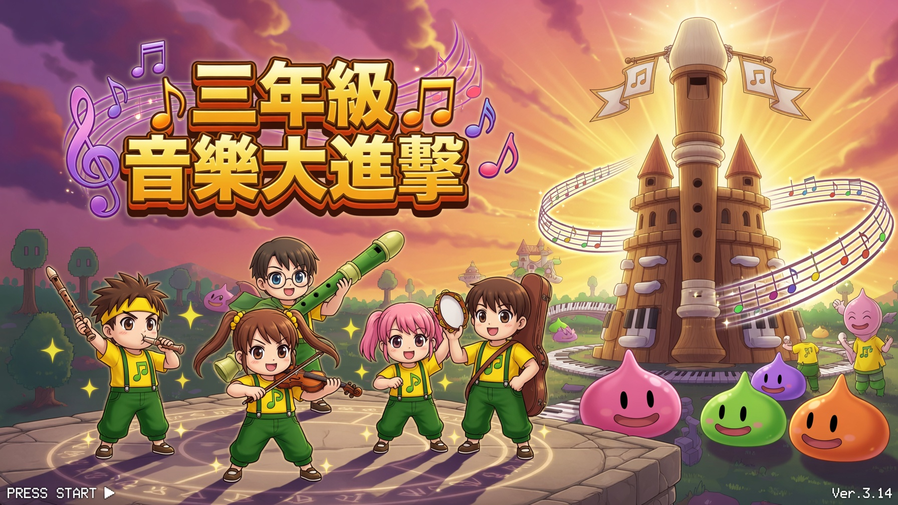
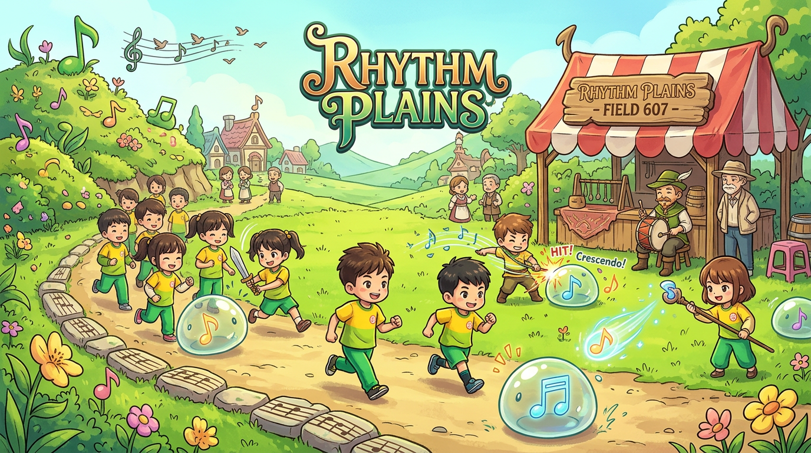
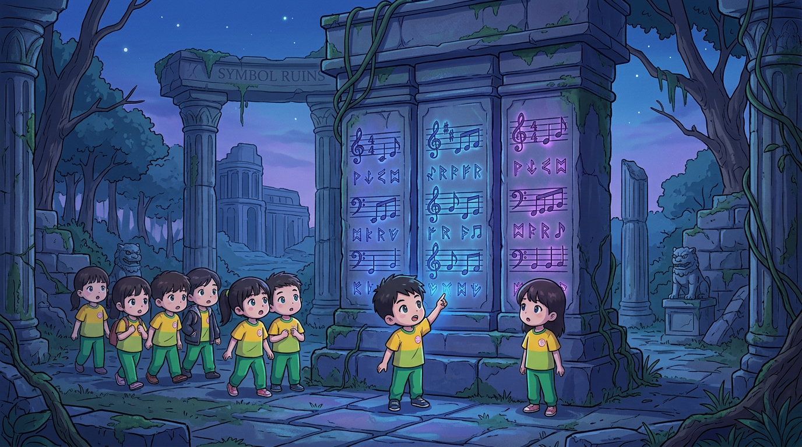
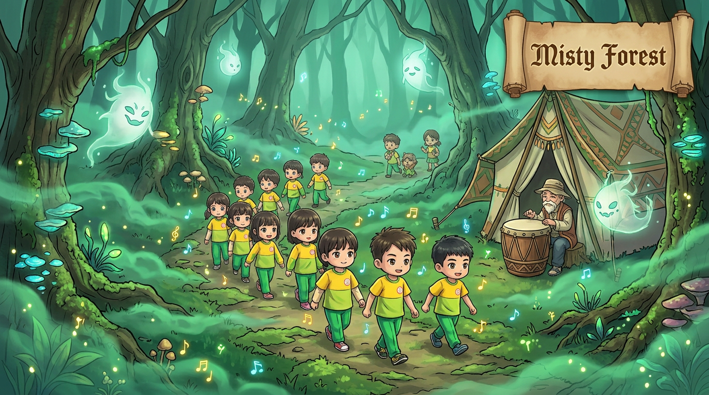
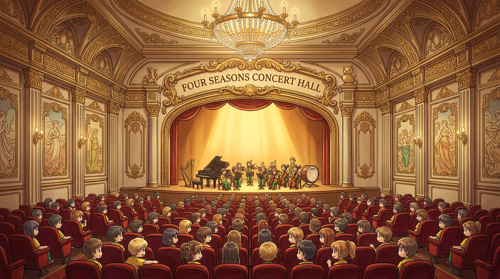
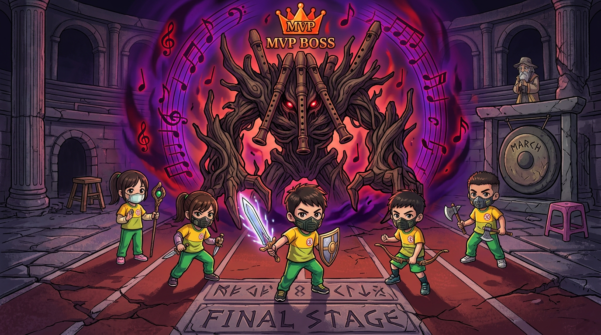

# 🎵 三年級音樂大進擊

> **RO 音符傳說：期末大冒險**  
> 一款為國小三年級音樂課設計的網頁 RPG 問答遊戲，讓期末複習變成一場熱血的闖關冒險！

---

## 🎮 遊戲畫面

### 首頁主視覺

### 五大冒險舞台

| 節奏平原 | 符號遺跡 | 迷霧森林 |
|:---:|:---:|:---:|
|  |  |  |

| 四季音樂廳 | 最終魔王戰 |
|:---:|:---:|
|  |  |

---

## 🧑‍🏫 適用對象

- 國小三年級音樂課期末複習
- 課堂互動問答活動
- 音樂基本概念教學輔助

---

## 📝 技術規格

- **純前端實作**：HTML + CSS + JavaScript，無需後端伺服器
- **Web Audio API**：內建音效合成（答對/答錯/升級/攻擊/開寶箱）
- **SVG 向量素材**：音符與指法圖無限縮放不失真
- **響應式設計**：支援各種螢幕尺寸

---

## 🙏 特別感謝

- 遊戲美術風格致敬 **Ragnarok Online（仙境傳說）**
- 角色制服設計參考真實校園運動服
- 音效系統使用原生 Web Audio API 合成

---

> 🎓 **祝各位冒險者通關順利，四年級音樂課繼續加油！** 🎵
